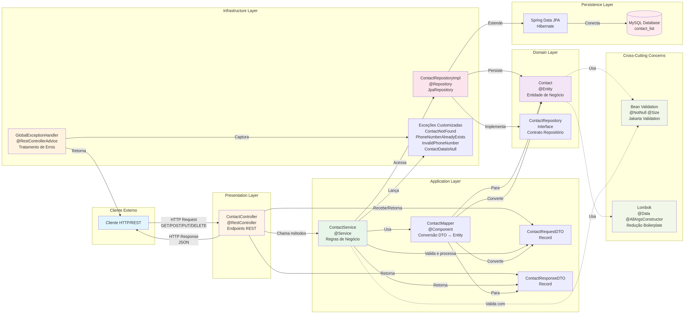

# 📱 Lista de Contatos - API REST

[](https://spring.io/projects/spring-boot)
[](https://www.oracle.com/java/)
[](https://www.mysql.com/)
[](LICENSE)

API REST profissional para gerenciamento de contatos desenvolvida com **Spring Boot 4.0.2** e **Java 21**, seguindo os princípios de **Clean Architecture** e **Hexagonal Architecture**.

## 📋 Sobre o Projeto

Sistema robusto de gerenciamento de contatos com operações CRUD completas, validação de dados e tratamento de erros profissional.

### Funcionalidades Principais

- Criar, listar, buscar, atualizar e deletar contatos
- Validação completa de dados (nome e telefone único)
- Tratamento centralizado de exceções
- Persistência em banco de dados MySQL

## 🏗️ Arquitetura

O projeto implementa **Clean Architecture** combinada com **Hexagonal Architecture**, garantindo separação de responsabilidades e alta manutenibilidade.



### Estrutura de Camadas

```
📦 com.listacontatos.jonathan
├── presentation/      # REST Controllers
├── application/       # Services, DTOs, Mappers
├── domain/           # Entities, Repository Interfaces
└── infra/            # Repository Implementation, Exception Handlers
```

**📖 Documentação completa:** [ARCHITECTURE.md](./ARCHITECTURE.md)

## 🚀 Começando

### Pré-requisitos

- **Java 21** ou superior
- **Maven 3.8+**
- **MySQL 8.0+**

### Instalação

1. **Clone o repositório**
   ```bash
   git clone https://github.com/jonathan7gb/Lista-Contatos-SpringBoot.git
   cd Lista-Contatos-SpringBoot
   ```

2. **Configure o banco de dados**
   ```sql
   CREATE DATABASE contact_list;
   ```

3. **Configure as credenciais** em `src/main/resources/application.properties`
   ```properties
   spring.datasource.url=jdbc:mysql://localhost:3306/contact_list
   spring.datasource.username=root
   spring.datasource.password=sua_senha
   ```

4. **Execute a aplicação**
   ```bash
   ./mvnw spring-boot:run
   ```

A API estará disponível em `http://localhost:8080`

## 📚 API Endpoints

| Método | Endpoint | Descrição |
|--------|----------|-----------|
| `POST` | `/contacts` | Criar novo contato |
| `GET` | `/contacts` | Listar todos os contatos |
| `GET` | `/contacts/{id}` | Buscar contato por ID |
| `PUT` | `/contacts/{id}` | Atualizar contato |
| `DELETE` | `/contacts/{id}` | Deletar contato |

### Exemplo de Uso

**Criar Contato:**
```bash
curl -X POST http://localhost:8080/contacts \
  -H "Content-Type: application/json" \
  -d '{
    "name": "João Silva",
    "phoneNumber": "5511999887766"
  }'
```

**Listar Contatos:**
```bash
curl http://localhost:8080/contacts
```

## 🛠️ Tecnologias Utilizadas

- **Spring Boot 4.0.2** - Framework principal
- **Spring Web MVC** - REST API
- **Spring Data JPA** - Persistência de dados
- **Hibernate** - ORM
- **MySQL** - Banco de dados relacional
- **Bean Validation** - Validação de dados
- **Lombok** - Redução de código boilerplate
- **Maven** - Gerenciamento de dependências

## ✅ Regras de Validação

- Nome obrigatório (3-35 caracteres)
- Telefone obrigatório (até 15 caracteres)
- Telefone deve ser único no sistema
- Dados não podem ser nulos ou vazios

## 🧪 Testes

```bash
# Executar testes
./mvnw test

# Executar testes com cobertura
./mvnw clean verify
```

## 📖 Documentação

- **[ARCHITECTURE.md](./ARCHITECTURE.md)** - Arquitetura detalhada com diagramas
- **Endpoints API** - Documentados acima

## 🤝 Contribuindo

Contribuições são bem-vindas! Para contribuir:

1. Fork o projeto
2. Crie uma branch (`git checkout -b feature/MinhaFeature`)
3. Commit suas mudanças (`git commit -m 'Adiciona MinhaFeature'`)
4. Push para a branch (`git push origin feature/MinhaFeature`)
5. Abra um Pull Request

## 📝 Licença

Este projeto está sob a licença MIT. Consulte o arquivo LICENSE para mais detalhes.

## 👨‍💻 Autor

**Jonathan**
- GitHub: [@jonathan7gb](https://github.com/jonathan7gb)

---

⭐ **Se este projeto foi útil, considere dar uma estrela no repositório!**
